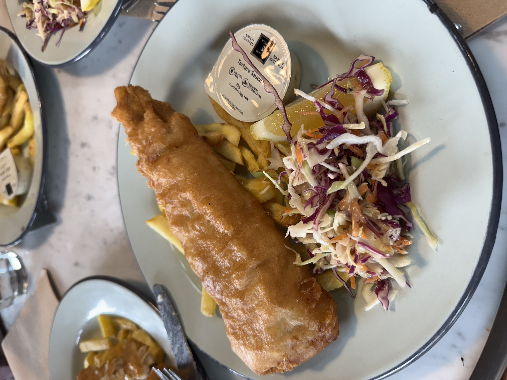
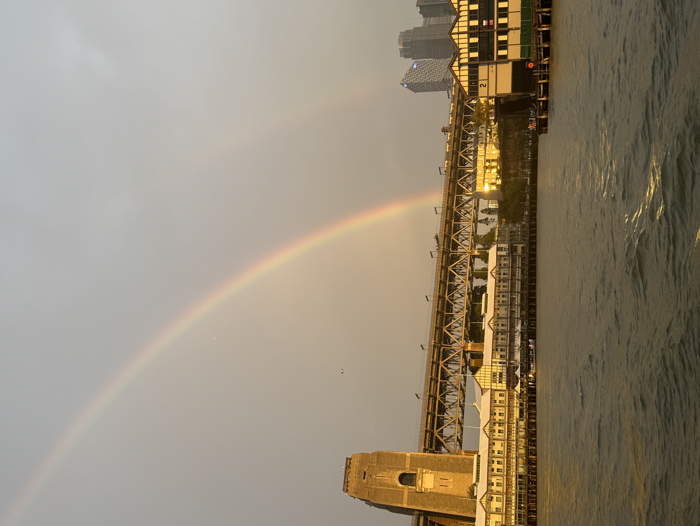
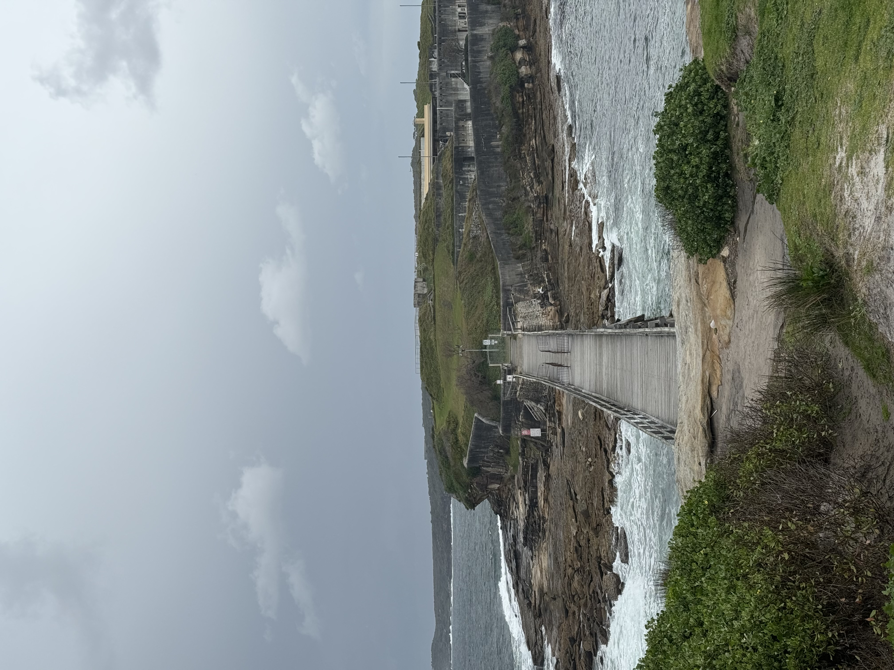
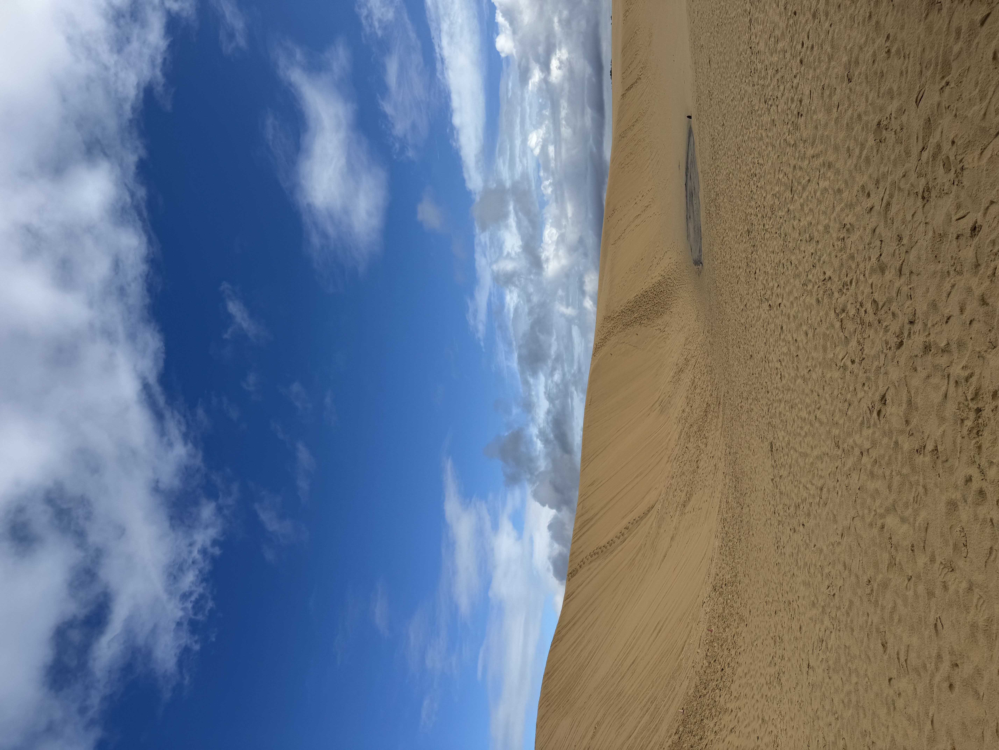
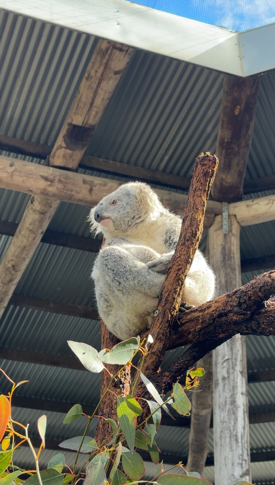
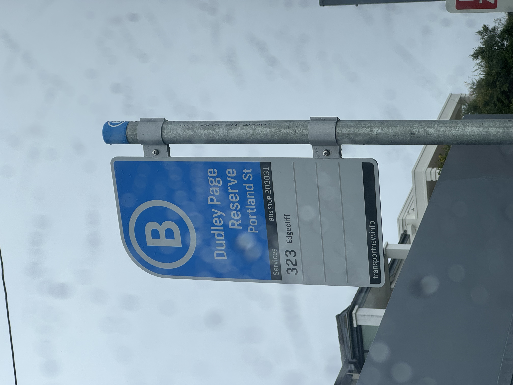
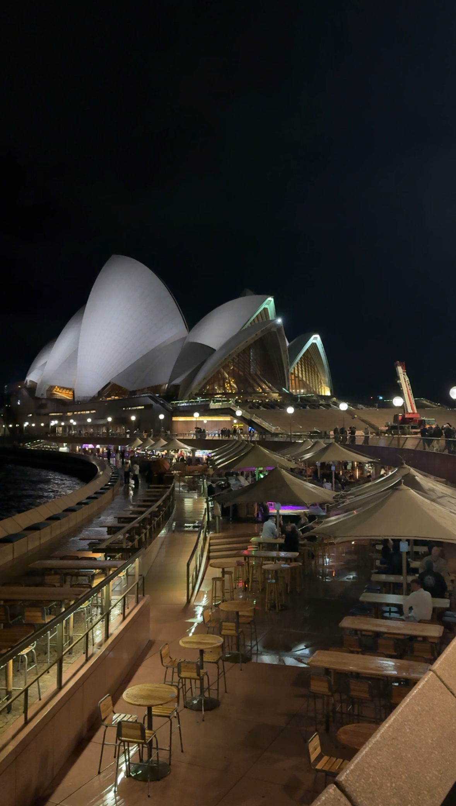
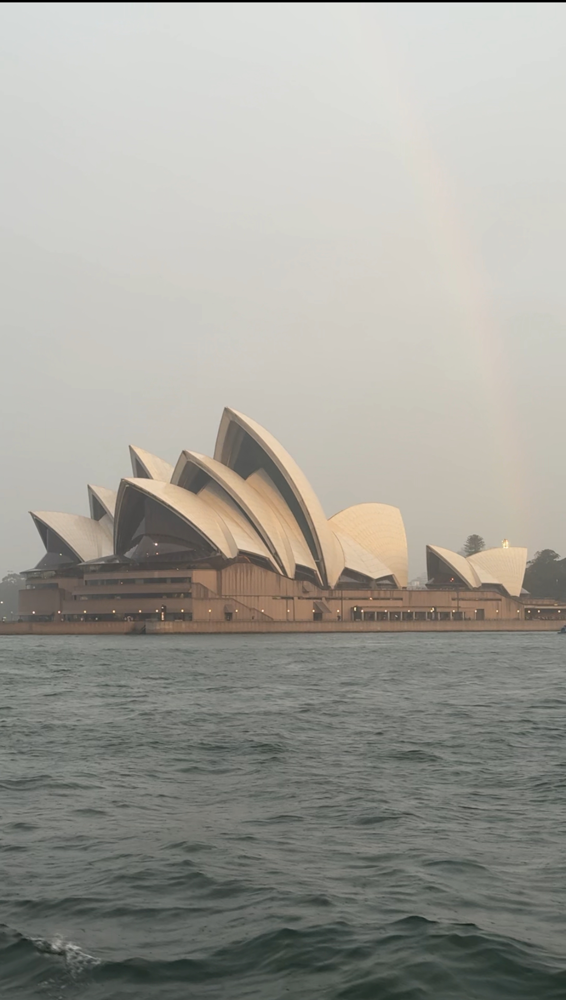

회사와 일, 반복되는 일상에 권태를 느끼던 즈음, 가족과 함께 호주 여행을 다녀왔다.
패키지 여행에 개인적인 인식이 별로 좋지 않았는데, 이번 여행을 통해 완전히 달라졌다.

최근엔 여행을 갈 때 자유여행을 선택했지만 아쉬움이 남았다. 유명한 관광지를 찾아가도 풍경을 보고 감탄하는 것 말고는 할 수 있는 게 많지 않았다.

이번엔 패키지여행으로 가이드분이 장소마다 호주의 문화와 역사 이야기를 들려주셨다. 단순한 관람이 아니라 ‘큐레이션’을 받는 느낌이 들어 훨씬 재미있었고, 지역을 더 깊이 이해할 수 있었다.

가이드분이 한국에서 호주로 이민 온 분이셨는데, 호주 특유의 여유로움과 자연스러운 건강함이 묻어나는 분이셔서, 그 분위기를 함께 느낄 수 있어 좋았다.

호주에서 음식을 먹으면 항상 같이 나오는 음식이 있었다. 한국에서 김치가 늘 곁들여지는 것처럼 호주에서는 감자튀김이 항상 음식 옆에 함께 나왔다. 사실 나는 튀김을 즐겨 먹지 않아 조금 아쉬웠지만, 같이 나온 토마토 소스는 정말 맛있었다.

호주의 토마토 소스는 100% 토마토로 만든다고 들었는데, 그래서인지 정말 맛있었다. 이번 여행 중 가장 맛있었던 음식은 Murray’s 와이너리 농장에서 먹은 피시 앤 칩스였다.

아쉬운 점도 있었다. 여행 내내 날씨가 흐려 호주의 맑은 하늘을 보지 못했다. 중간중간 해가 비치긴 했지만, 블루마운틴의 에코 포인트에 갔을 때는 안개가 짙게 껴서 아무것도 보지 못했다.

호주 여행을 하면서 제일 좋았던 것은 여행을 다니며 본 호주사람들의 여유와 분위기와 한국에서 느낄 수 없는 자연과 깨끗한 공기를 맡으며 행복함을 느끼고 있는 나를 볼 수 있었던 점이다.

특히 마지막 날 본다이 비치와 크루즈에서 본 무지개는 날씨에 대한 아쉬움을 조금 잊게 해준 것 같다.

### 그외 사진

